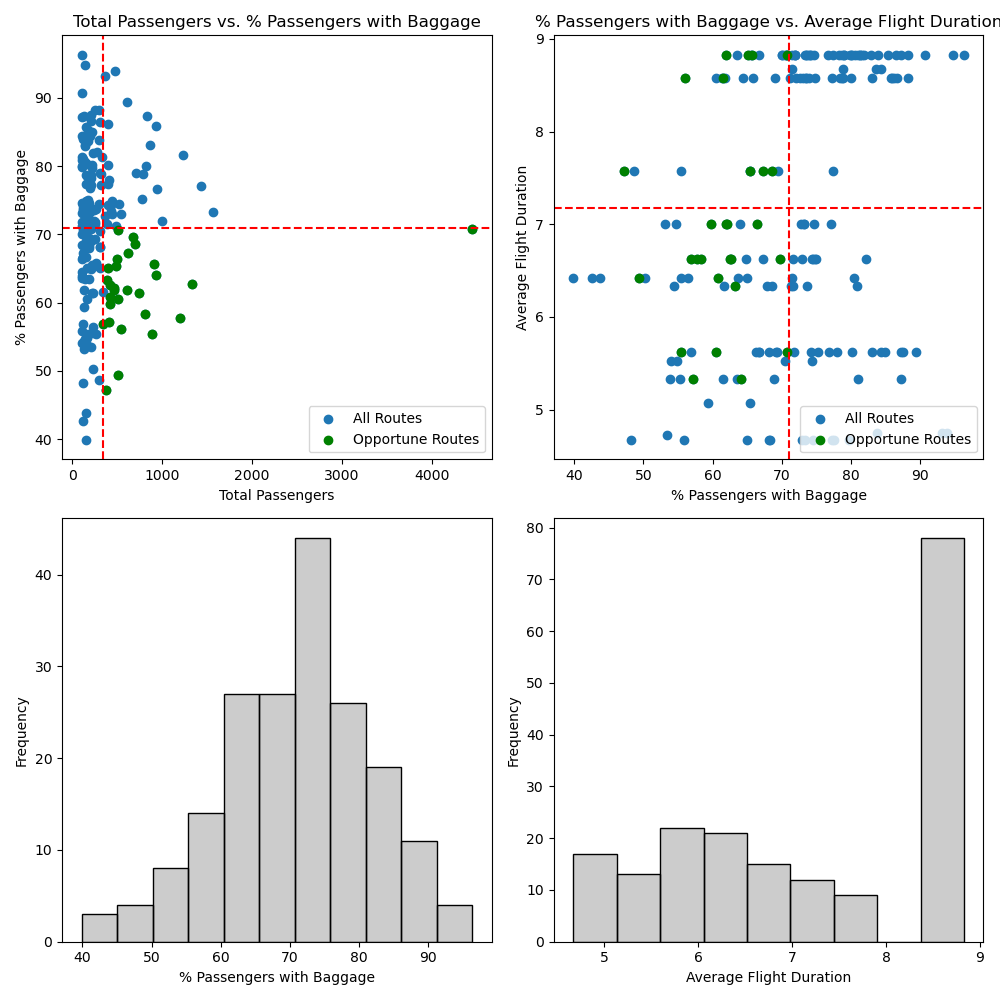
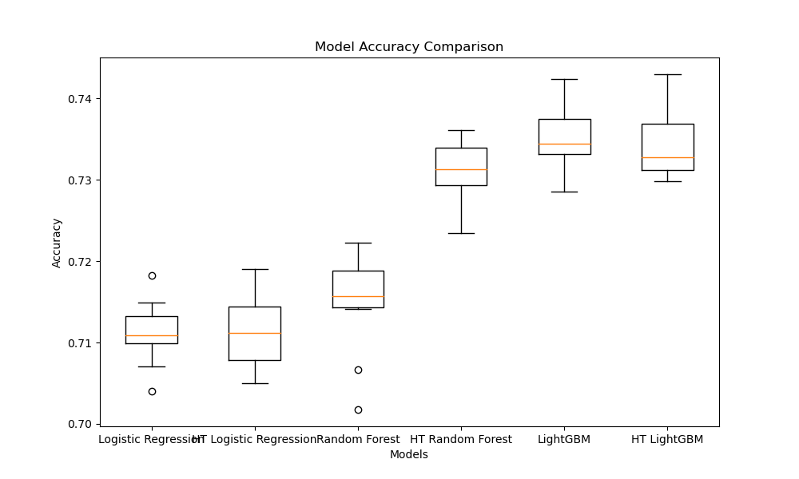

# Airlines Analysis (Oceania Region Dataset)

## Overview

In this analysis, I aim to explore a dataset containing information about airline bookings in the Oceania region. The focus will be on understanding customer preferences regarding extra baggage options and creating a predictive model to forecast the number of bags purchased based on various parameters. By identifying flights that underperform in selling baggage options, this could help target poorly performing customer segments for the creation of effective marketing campaigns.
- mention dataset and its sepcifications

## Research Question

How can we use statistical methods to identify flights that are underperforming on selling baggage options, and how can we create a predictive model to forecast the number of bags purchased based on other parameters in the dataset?

## Data

| Column Name          | Description                                               |
|----------------------|-----------------------------------------------------------|
| num_passengers       | Number of passengers travelling                            |
| sales_channel        | Sales channel booking was made on                          |
| trip_type            | Type of trip (Round Trip, One Way, Circle Trip)           |
| purchase_lead        | Number of days between travel date and booking date       |
| length_of_stay       | Number of days spent at destination                       |
| flight_hour          | Hour of flight departure                                  |
| flight_day           | Day of the week of flight departure                       |
| route                | Origin -> Destination flight route                        |
| booking_origin       | Country from where booking was made                       |
| wants_extra_baggage  | Whether the customer wanted extra baggage in the booking  |
| wants_preferred_seat | Whether the customer wanted a preferred seat in the booking|
| wants_in_flight_meals| Whether the customer wanted in-flight meals in the booking|
| flight_duration      | Total duration of flight (in hours)                       |
| booking_complete     | Flag indicating if the customer completed the booking     |

Data pulled from : 
Limitations?

## Analysis Design

With the availability of the Oceania airline dataset, I outline the steps taken 

Exploratory Data Analysis (EDA): Analyze the distribution of variables, identify correlations, and explore patterns related to baggage options.
- Investigate underperforming routes in the Oceania region.
- Statistical Analysis: Conduct hypothesis testing to experiment the simplicity of the relationship between baggage purchases and flight duration. This will help us understand the need for machine learning, or not.

Model Development: Train predictive models such as regression, decision trees, or neural networks to forecast the number of bags purchased.
- Data Cleaning and Preprocessing: Remove any missing or inconsistent data, and encode categorical variables.
- Feature Selection: Select relevant features for building the predictive model.
- Model Evaluation: Evaluate the performance of the models using appropriate metrics such as mean squared error or R-squared.
- Interpretation: Interpret the results to identify key factors influencing baggage purchases and flights that require targeted marketing campaigns.

## Analysis & Results

### Hypethesis Testing
Through the use of statistical methods, we address : Do all flight paths have an equal distribution of baggage purchases. Our alternative hypothesis is that there is a difference in baggage purchases based on the flight duration. We assess at the a = 0.05 level.

Operationalization : 
- Remove high-variance small sample flight routes, conduct analysis with remaining flights.
- We remove added variance and create a binary target variable. Of course, this removes information from our analysis but we instead simplify the interpretation of our analysis.
- Employed a 2-sample T-Test for statistical inference. Our two groups are routes above and below the mean flight duration time. 

Test Results : 
- Given the ambiguity in the data collection steps for this Kaggle dataset, we cannot verify the IID assumption needed for the 2-sample T-test. Typically I would halt this investigation, but for this project, I will continue with the assumption that this dataset contains all flights from a limited period of time in the Oceania region. The only major violation in this case would be year over year discrepancies not accounted for. That is, however, outside the scope and we can move forward with these assumptions. Otherwise, the other assumptions for this T-Test are met (see exploratory_analysis.ipynb).
- We conclude that there is a significant difference based on flight duration. This result rejects the null hypothesis. Practically, this helps with our understanding of the factors that influence a passenger to purchase baggage. While we can conduct a similar experiment for other factors, we assume that there is more complexity in a passenger's decision making that involve conditional distributions between factors. Therefore, I will employ more complex modeling through the use of machine learning to predict passengers that make baggage purchases.

### Identifying Underperforming Flights

During the exploratory analysis, I identified routes that fall below the average in terms of baggage purchase percentage but above the average in terms of the number of passengers. These routes are labeled as "Opportune Routes". Targeting these routes can enhance average baggage purchase conversions, uncovering a practical significance. By employing customer identification machine learning algorithms, companies can create promotional strategies aimed at high-willingness-to-buy individuals. This approach can boost baggage purchases and consequently baggage revenue margins, especially since these flight routes are underperforming compared to others. Additionally, statistical inference revealed that baggage purchases are not solely determined by high or low flight durations, indicating a more nuanced relationship that can be revealed through machine learning.

### Predictive Model Development
- With this dataset, we use the other parameters to predict a customer's purchase for extra baggage on their flight. This is a binary target, so it's important that we use three supervised classifier algorithms in our model creation. I have selected 3 notable classifiers, and the analysis is limited to this selection only: Logistic Regression, Random Forests Classifier, and LightGBM Classifier. 

- The models is trained on 70% of the data, while 10% is reserved as a validation set, and 20% is reserved as the final test set. Each model is evaluated by accuracy of the predictions, however, I also take note of precision and recall metrics for a complete analysis. If you would like to see the detailed metrics, please see model_building.ipynb.

- The baseline estimate is 67%, therefore a viable production-level model will need to exceed this estimate in order for it to be of any use to the company.

## Conclusion
- LightGBM (Default) performs the best on the test set results, with 73% Accuracy. Compared to our baseline, this is a +6% accuracy improvement that can be utilized in production. By using this model, we can correctly identify 73% of customers that would want a baggage option with the given parameters. 

- This can be really useful. Our model can select customers that would want extra baggage by the other dimensions. If these customers do not select extra baggage, one strategy could be to offer them promotions that may increase their likelihood of purchase a baggage option, thereby raising the bottomline of revenue! With AB Testing, this can be tested robustly, with a final revenue sizing estimation.

- Furthermore, this type of analysis can be conducted for other parameters like Preferred Seating, In-Flight Meals, etc. We could even perform this type of anlaysis for specific routes or booking origins. This is the end of my analysis, please reach out if you have any further questions.
